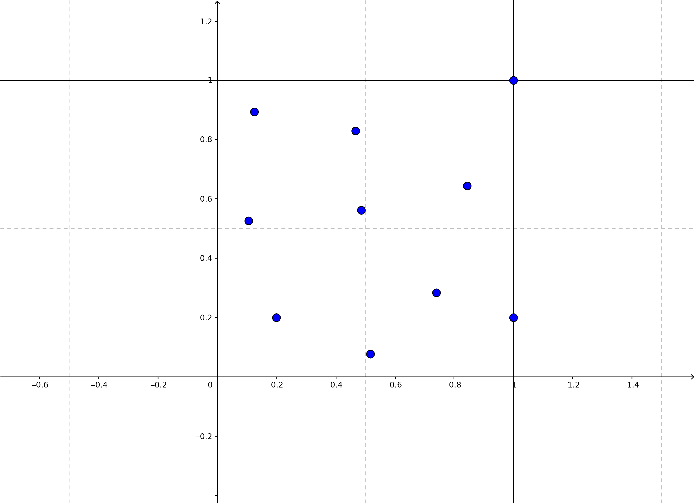
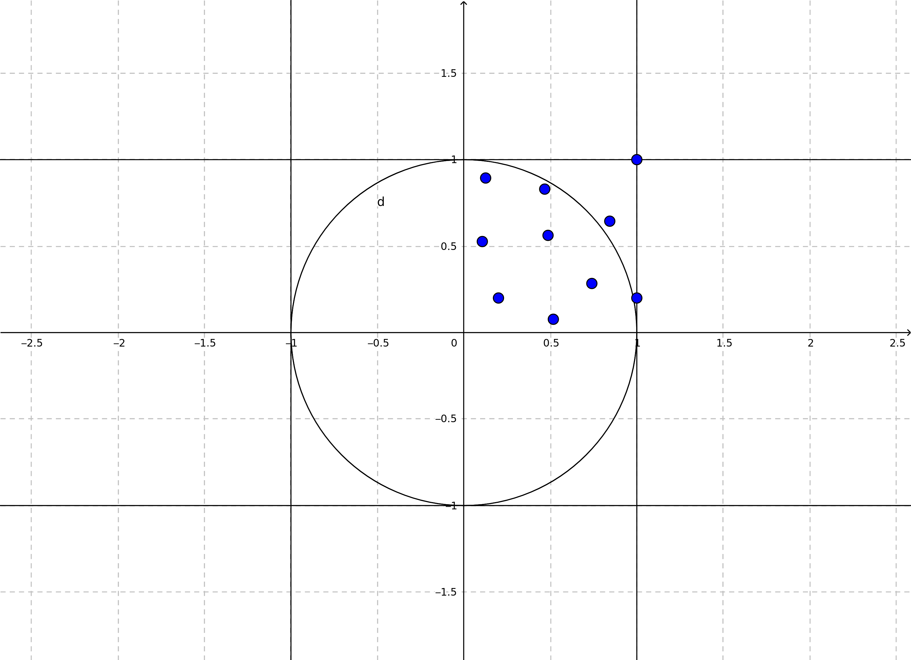

# RandomPi

Software para calcular o valor de pi baseado exclusivamente na geração aleatória de números entre 0 e 1.

### Instalando as dependências

Clone esse repositório e:
```
pip3 install argparse
```

### O problema

Você tem uma função chamada *random()* que gera um número de 0 a 1 de modo aleatório e uniformamente distribuído.
Calcule o valor de pi.

### A Resolução

A ideia básica é gerar dois números aleatórios com a função *random()* de modo a criar as coordenadas cartesianas de um ponto dentro de um plano. Depois disso, gera-se *n* coordenadas do mesmo modo:



Podemos agora considerar a área com os pontos acima como um quarto de um quadrado 2x2. Se desenharmos um círculo de raio 1 inteiramente dentro desse quadrado teremos:



O objetivo agora é contar o número de pontos dentro do círculo e todos os que estão dentro do quadrado.
A proporção entre esses dois números será aproximadamente a mesma proporção entre a área do círculo e a área do quadrado.

> (Área círculo)/(Área quadrado) = (Número de pontos dentro do círculo)/(Número de pontos total)

Para saber se um ponto está ou não dentro do círculo, utiliza-se do Teorema de Pitágoras, assim, se a distância da coordenada de um ponto é menor que o tamanho do raio da circunferência, ele está dentro do círculo:

> Distância = (x^2 + y^2)^(1/2)

Sabe-se que a área de um círculo é:

> Área círculo = PI * r^2

E que a fórmula da área desse quadrado é:

> Área quadrado = (2 * r)^2

Assim encontramos a equação:

> (PI * r^2)/((2 * r)^2) = (Número de pontos dentro do círculo)/(Número de pontos total)

Dela podemos deduzir a fórmula:

> PI = 4 * (Número de pontos dentro do círculo)/(Número de pontos total)

E assim, encontramos o valor de pi utilizando apenas a função *random()*.


**[Problema baseado neste vídeo do canal 'Joma Tech'](https://www.youtube.com/watch?v=pvimAM_SLic&feature=youtu.be)**
